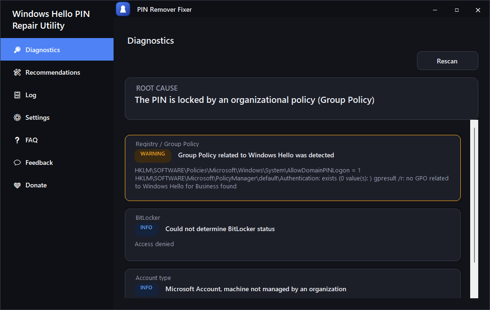
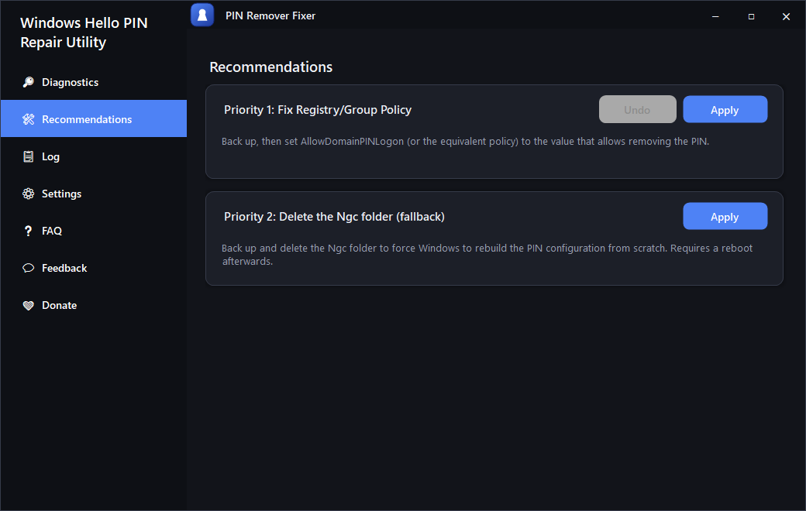
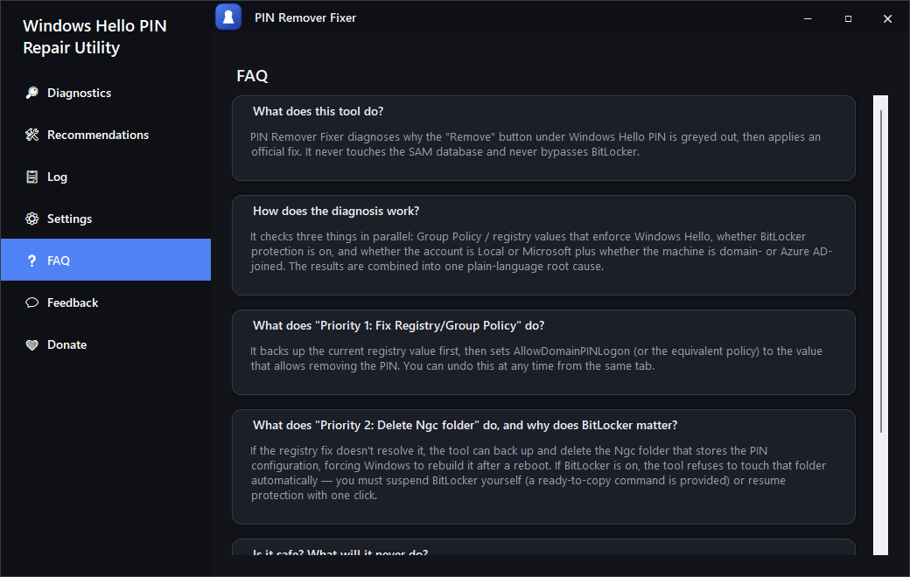
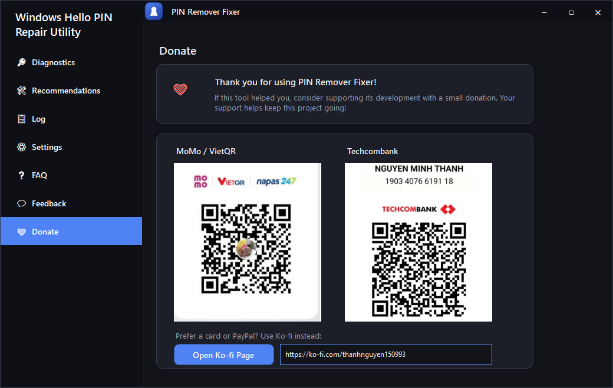

# PIN Remover Fixer


A Windows desktop tool that diagnoses **why the "Remove" button under Windows Hello PIN is greyed out**, and applies an official fix — following the sanctioned path only. It never touches the SAM database, never bypasses BitLocker, and never suspends BitLocker automatically without your explicit action.

## Screenshots

| Diagnostics | Recommendations |
| --- | --- |
|  |  |

| FAQ | Donate |
| --- | --- |
|  |  |

## What it does

Windows sometimes disables the **Remove** button in `Settings → Accounts → Sign-in options → PIN (Windows Hello)`, even on a personal machine that doesn't need enterprise-grade security. The most common cause is a Group Policy / registry value that enforces Windows Hello (typically seen on domain- or Azure AD-joined machines, but occasionally misconfigured on personal ones too).

This tool:

1. **Diagnoses** the cause by checking three things in parallel:
   - Group Policy / registry values that enforce Windows Hello
   - Whether BitLocker protection is on for the system drive
   - Whether the account is Local or Microsoft, and whether the machine is domain- or Azure AD-joined
2. **Recommends a fix**, in priority order, and never applies anything automatically:
   - **Priority 1 — Fix Registry/Group Policy**: backs up the current value, then sets it to allow removing the PIN. Fully reversible with a one-click Undo.
   - **Priority 2 — Delete the `Ngc` folder (fallback)**: backs up and deletes the folder that stores the PIN configuration, forcing Windows to rebuild it after a reboot. **Blocked automatically if BitLocker is on** — you're given a ready-to-copy command to suspend it yourself, or a button to resume protection.
3. **Logs everything** — every registry change, backup, and fix attempt is recorded and viewable in the Log tab.

## Core safety principles

- ❌ Never modifies the SAM (Security Account Manager) database
- ❌ Never bypasses or vaults over BitLocker under any circumstance
- ❌ Never suspends BitLocker automatically without explicit, separate user action

## Features

- **Diagnostics engine** — three checks run in parallel, combined into one plain-language root cause
- **Priority-based fixes** with backup + one-click undo for the registry path
- **BitLocker-aware fallback** — refuses to touch the `Ngc` folder while protection is on
- **System tray integration** — minimizes to tray instead of closing, single-instance guard (a second launch just focuses the existing window)
- **Bilingual UI** — English and Vietnamese, switchable anytime from Settings, applied instantly without a restart
- **Self-contained** — ships as a single `.exe` with no companion DLLs
- **FAQ, Feedback, and Donate tabs** built in

## Requirements

- Windows 10 or 11
- .NET Framework 4.8 (preinstalled on virtually all up-to-date Windows systems)
- Administrator rights (the app requests elevation via UAC automatically)

## Building from source

```bash
dotnet build
```

The build produces a single self-contained `frm_pin_remover.exe` in `bin/Debug/net48/` (or `bin/Release/net48/` for a release build) — third-party dependencies are woven directly into the executable at build time via [Costura.Fody](https://github.com/Fody/Costura), so that one file is all you need to copy to another machine.

## Tech stack

- C#, WinForms, .NET Framework 4.8
- [Guna.UI2.WinForms](https://github.com/Taiizor/Guna.UI2.WinForms) for the UI controls
- [Fody](https://github.com/Fody/Fody) / [Costura.Fody](https://github.com/Fody/Costura) to embed dependencies into the executable

## Contributing

Issues and pull requests are welcome. Please keep changes aligned with the core safety principles above — anything that bypasses BitLocker or edits the SAM database directly will not be accepted.

## Support the project

If this tool helped you, consider supporting its development — see the **Donate** tab in the app, or:

- Ko-fi: https://ko-fi.com/thanhnguyen150993

## License

Licensed under the [MIT License](LICENSE).
